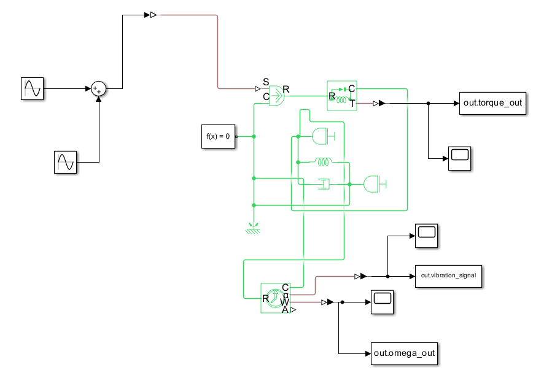
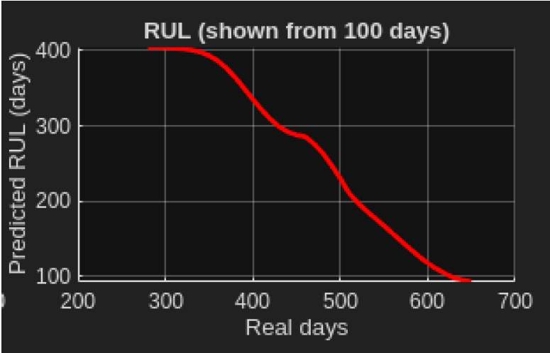
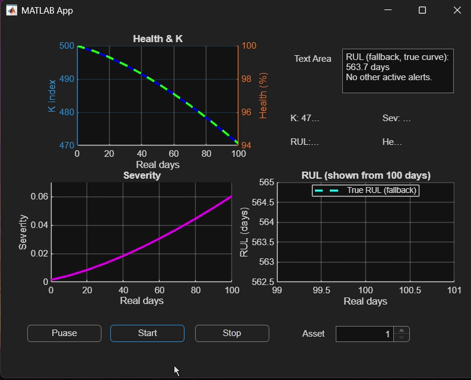

# Digital Twin of a Rotating Shaft for Predictive Maintenance

A physics-based digital twin combined with a deep learning model to predict the Remaining Useful Life (RUL) of a rotating shaft, built in MATLAB, Simulink, and Simscape.

## Overview

Rotating shafts in pumps, compressors, turbines, and gearboxes degrade gradually under continuous operation, and that degradation typically shows up first in vibration, torque, and speed signals. This project builds an end-to-end pipeline that:

1. Simulates a rotating shaft's dynamics and generates sensor-like signals
2. Injects progressive degradation to create synthetic lifecycle data (since real run-to-failure data is scarce)
3. Extracts condition-based features from the signals
4. Predicts remaining useful life in days using a Bidirectional LSTM with attention
5. Visualizes everything live in a monitoring dashboard

## Digital twin model

The shaft is modeled in Simulink/Simscape as a rotational mechanical system:

- **Shaft inertia** captures energy storage and governs the transient response to applied torque
- **Viscous damping** represents frictional and dissipative losses
- **Mechanical reference** establishes a physical ground so torque and angular velocity states stay numerically stable
- **Excitation** combines a commanded input with optional disturbance terms to represent operating variability

Virtual sensors log angular speed and shaft torque directly, and a vibration-related signal is derived from the mechanical response — all exported to the MATLAB workspace at a fixed sampling rate. Degradation is introduced by progressively increasing fault severity through parameterized changes, producing coherent lifecycle trajectories rather than a single healthy/failed snapshot.

## Data pipeline

Each day of simulated signal is reduced to a **12-dimensional feature vector**: RMS vibration, peak and peak-to-peak amplitude, crest factor, kurtosis, skewness, dominant frequency, low/mid/high-band spectral energy, mean speed, and mean input level. Features are normalized against a healthy baseline to form an interpretable health index.

Thirty consecutive days of feature vectors are assembled into a **(30 x 12) sequence** — the input to the RUL model.

## RUL prediction model

A **Bidirectional LSTM with an attention mechanism** processes the 30-day sequence and outputs a single RUL estimate in days. The BiLSTM reads the sequence in both directions to use context from the full history window, while attention weights the time steps that matter most for the prediction — typically periods where degradation accelerates.

## Results

Evaluated on a held-out test set:

| Metric | Value | Unit | Notes |
|---|---|---|---|
| MAE | 2.46 | days | Average absolute error |
| RMSE | 2.93 | days | Penalizes large errors |
| R² | 0.927 | – | Variance explained |
| Accuracy (±5 days) | 92.3 | % | Practical tolerance |

## Dashboard

A MATLAB App Designer dashboard consolidates the health index, degradation severity, and predicted RUL in real time, with start/pause/stop controls and alerts when health drops below 60% or predicted RUL falls under 100 days.

## Tech stack

MATLAB · Simulink · Simscape · Signal Processing Toolbox · Deep Learning (BiLSTM + Attention) · App Designer

## Repository contents

- Project report and proposal (PDF)
- Presentation slides
- Model training and FFT generation code
- Simulink/Simscape model files

## Limitations

This is a simulation-driven study: degradation trajectories are generated from the digital twin rather than measured run-to-failure data. Calibration against a physical system and validation across multiple operating regimes are the natural next steps.
